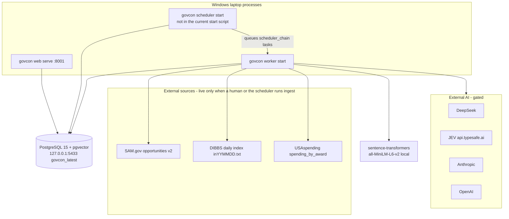

# GovCon end-to-end audit — 2026-10-05

Audit of branch `audit10032026` at `fddb61a` (merged PR #26). Findings are labeled **verified** (read in this tree), **inferred**, or **unknown**. Citations are `path:line`. No live SAM, DIBBS, USAspending, DeepSeek, JEV, or Anthropic calls were made. Secret values were not read.

The operator brief and the Windows laptop notes were treated as requirements and hypotheses. Where the code disagrees with those notes, the code is the finding.

## 1. Architecture

Python 3.12 package `govcon` (`pyproject.toml`). FastAPI + Jinja templates + a small amount of HTMX. PostgreSQL with pgvector. One process model: web, worker, and scheduler are separate CLI processes that share one database. Docker Compose starts **only** Postgres (`docker-compose.yml`); it is not how the laptop runs.

### Startup and deploy

| Piece | What actually happens | Evidence |
|---|---|---|
| Schema | Alembic. Head is `b4c5d6e7f8a9` (`registration_freshness`). | `alembic/versions/b4c5d6e7f8a9_registration_freshness.py:10` |
| Web | `govcon web serve` binds `127.0.0.1` by default, port flag default **8000**. Laptop uses **8001**. | `src/govcon/web/app.py:189`, `src/govcon/cli.py:3452` |
| Worker | `govcon worker start` claims `tasks` with `SKIP LOCKED` and a lease. | `src/govcon/tasks/worker.py:1` |
| Scheduler | `govcon scheduler start`. Advisory lock `pg_try_advisory_lock(742901, 2)` so only one daemon owns the schedule. Optional embedded worker for chain tasks. | `src/govcon/scheduler/runner.py:37` |
| Repo scripts | `scripts/smoke.sh` only. **No Windows start/stop/status scripts.** | **verified** |
| README | Still says Docker is required and that the web UI is "a later phase". Both are stale. | `README.md:8`, `README.md:195` |

Laptop hypothesis "scheduler is not running" matches the absence of any start script in the repo. Whether the desktop `Start-GovCon.ps1` outside the repo starts it was **not** verified here.

## 2. Data model (the tables this audit depends on)

Defined in `src/govcon/models.py`.

| Table | Role |
|---|---|
| `opportunities` | One row per `(source, source_id)`. Status, deadline, PSC/NAICS, `raw`, `raw_hash`, embedding. `models.py:55` |
| `opportunity_snapshots` | Immutable raw payload per content hash. `models.py:105` |
| `opportunity_events` | Field-level changes (deadline, files, set-aside, cancel). `models.py:121` |
| `matches` | Watchlist hit. Status `new/seen/dismissed/reviewing/pursuing`. `alerted_at` is the alert watermark. `models.py:241` |
| `pursuits` | Commercial stage: `evaluating`, `bid_approved`, `sourcing`, `drafting`, `review`, `ready_to_submit`, `submitted`, `won`, `lost`, `cancelled`, `no_bid`. `models.py:462` |
| `files` / `file_pages` | Attachment bytes, classification, extraction and OCR. `models.py:493` |
| `requirements` | Cited requirement rows from the compliance pipeline. `models.py:664` |
| `ai_analyses`, `ai_call_usage` | Structured model output and reserved cost. `models.py:394`, `models.py:553` |
| `decision_runs`, `bid_decisions` | JEV or rules recommendation. `models.py:639` |
| `ingestion_runs`, `scheduler_job_runs` | Ingest and chain history. `models.py:995`, `models.py:1010` |
| `tasks` | Durable queue. Dedup key unique while not terminal. `models.py:1038` |

## 3. Routes

Registered in `src/govcon/web/app.py`. Authenticated UI unless noted.

| Route | What the operator sees |
|---|---|
| `GET /health` | Unauthenticated JSON. Database `SELECT 1` only. `app.py:53` |
| `GET /` | Inbox of **new** matches, 50 per watchlist. Not a four-question dashboard. `routes/__init__.py:338` |
| `GET /search` | Opportunity list. Hard cap 100, no pages. `routes/__init__.py:447` |
| `GET /opp/{id}` | Read-only detail. |
| `GET /workspace/{id}` | Pursuit workspace (documents, decision, compliance, review, proposal). |
| `GET /pipeline` | Many internal columns, including two that the stage machine does not fill (`compliance`, `ready_for_review`). `routes/__init__.py:1315` |
| `GET /settings` | Auto-prepare, auto-pursue, reviewers, SAM registration, AI quote authorization. |
| `GET /ops` | Counts, failed tasks, 30-day AI usage, chain cron **text**, last runs, ingestion runs. No next-run time, no live health. `routes/__init__.py:1724` |
| `GET /notifications`, `/watchlists`, `/vendors`, `/suppliers`, `/learning` | Supporting pages. |

HTMX is loaded from `unpkg.com` (`templates/base.html:8`). **Verified** external script dependency for a local app.

## 4. Workers, scheduler, integrations

### Scheduler chains

`src/govcon/scheduler/chains.py:50` and `src/govcon/scheduler/runner.py:96`.

| Job id | Code today | Operator asked for (America/Los_Angeles) |
|---|---|---|
| `morning_ingest` | 06:30 **UTC** | 11:30 PM PT — SAM, DIBBS, match, alerts |
| `usaspending` | 07:30 UTC | 12:30 AM PT |
| `embeddings` | 08:00 UTC | 1:00 AM PT |
| `midday_check` | 12:00 UTC | 5:00 AM PT deadline/amendment |
| `evening_ingest` | 18:00 UTC | 11:00 AM PT second SAM/DIBBS cycle |
| `sunday_sweep` | Sunday 09:00 UTC | Sunday 2:00 AM PT archive/cache/analytics/VACUUM |

**Verified:** those UTC clocks equal the requested local times only while Pacific Daylight Time is in effect (UTC−7). They are one hour early in Pacific Standard Time. `CronTrigger(..., timezone="UTC")` does not follow DST. The coordinator note is correct.

`misfire_grace_time` is 600 seconds (1800 on Sunday) and `coalesce=True` (`runner.py:105`). A laptop that was asleep longer than 10 minutes does **not** catch up. **Verified.** Advisory locks stop two workers running the same chain (`chains.py:97`). Ingest steps are soft, so a SAM failure still allows match and alerts on whatever is already stored (`chains.py:7`).

Morning/evening steps: `sam_ingest → dibbs_ingest → source_changes → match → rank → auto_pursue → alerts`. There is **no** AI analysis or JEV step on that chain. **Verified.**

### Source access vs current public docs

Checked 2026-10-06 against public pages only (no API key sent).

- **SAM.gov** Get Opportunities Public API still documents production `https://api.sam.gov/opportunities/v2/search`, `postedFrom`/`postedTo` `MM/dd/yyyy` at most one year apart, `limit` max 1000, `offset` as **page index**, description as a URL that needs the API key appended, `resourceLinks` as attachment URLs, and "latest active version" only. Source: [open.gsa.gov/api/get-opportunities-public-api](https://open.gsa.gov/api/get-opportunities-public-api/). The client matches that contract (`src/govcon/ingest/sam_opportunities.py:1`). Daily quota is role-based; the exact remaining quota for this account is **unknown**.
- **DIBBS** is still `https://www.dibbs.bsm.dla.mil/` (notice-and-consent banner, version 6.3.2 on the public homepage). DLA describes it as search/view/submit quotes; registration is required to quote. The code downloads only the public fixed-width index `inYYMMDD.txt` after posting the consent form, and does **not** download `caYYMMDD.zip` PDFs (`src/govcon/ingest/dibbs.py:1`). Whether DLA's current terms allow unattended index download is **inferred** as acceptable for public listings and **unknown** as a formal written permission. Quote submission is not implemented and must stay that way.
- **USAspending** `POST https://api.usaspending.gov/api/v2/search/spending_by_award/` with no key (`src/govcon/ingest/usaspending.py`).

### AI outbound paths

Every generative call is supposed to pass `authorize_external_call` **before** HTTP (`src/govcon/ai/gateway.py:21`).

| Path | Gate before HTTP | Retries | Logs | Fallback |
|---|---|---|---|---|
| Structured prompts (summary, compliance, proposal, amendments, reviews) | `prepare_structured_call` authorizes, then `complete_with_budget` authorizes again, then the provider `complete()` authorizes a third time. `structured.py:189`, `budget.py:176`, `deepseek.py:84` | `AI_MAX_PROVIDER_RETRIES` (default 2) on 408/409/429/5xx. Same classification, new budget reservation each try. `budget.py:203` | Gateway logs provider, model, classification, purpose. DeepSeek logs status only, not the body. `deepseek.py:122` | Structured failure stores nothing as a valid analysis. `structured.py:8` |
| JEV `POST {base}/v1/systemone` | Authorizes using `state["data_classification"]`. Default base `https://api.typesafe.ai` when `JEV_BASE_URL` is empty. `decision/providers/jev.py:26`, `jev.py:84` | No retry loop. HTTP failure becomes `DecisionProviderUnavailable`. | Status only, not the body. `jev.py:119` | Rules provider. `decision/engine.py:347` |
| LLM decision fallback | Through `complete_with_budget` (gated). Only if fallback provider is `llm` or the caller passes `allow_llm_fallback`. Default fallback is `rules`. `engine.py:409` | Same as other provider calls. | Same gateway line. | Stays on rules if the LLM call is blocked. |
| Prompt eval / compliance regression | `enforce_prompt_policy` then `complete_with_budget`. | Same. | Same. | Evaluation fails closed. |
| Embeddings | Local `SentenceTransformer`. Cold start **may** download weights from Hugging Face if they are not cached. `enrich/embeddings.py:48`. **Inferred** network on first use. | n/a | Model name only. | Job fails; matches are not invented. |

`UNKNOWN` and `SECRET_CREDENTIAL` are always blocked. `PROPRIETARY`, `FCI`, and `CUI` are blocked unless the matching `AI_EXTERNAL_ALLOWED_FOR_*` flag is true. Default is false (`config.py:49`). Government-feed downloads are stored as `PUBLIC` (`enrich/attachments.py`). The decision engine then **raises** the bundle state to at least `PROPRIETARY` because the state includes company data (`decision/engine.py:337`). With the laptop flags false, JEV is not called and the rules engine is the recommendation. That is fail-closed, not a silent "AI complete". **Verified.**

A failed provider must not mark work complete: compliance can finish `incomplete` (**verified** in compliance pipeline tests and `structured.py` fail-closed). The inbox can still show a match with no analysis; nothing in the UI says "analysis did not run" on the dashboard. **Verified** gap.

Alert delivery: `run_digest` sends SMTP when `SMTP_HOST` and `ALERT_EMAIL_TO` are set, otherwise writes `OUTBOX_DIR` (`alerts/digest.py:1`). `alerted_at` is stamped after delivery. A crash between send and commit can alert twice. **Verified** (`digest.py:99`). The laptop has SMTP empty, so current runs should be outbox-only. **Inferred** from the coordinator note, not from reading `.env`.

Nothing in the scheduled chain submits a proposal or emails a contracting officer. Submission checklist text says the human submits on the portal (`submissions/checklist.py`). **Verified.** Auto-pursue can open a pursuit when the owner turns it on; bid approval stays human (`matching/auto_pursue.py:16`).

## 5. One opportunity, end to end

Example: a SAM notice that hits the industrial-MRO watchlist. DIBBS is the same upsert path with a different normalizer and **no** attachment bytes.

1. **Ingest.** `pull_sam_opportunities` pages `offset` as a page index (`sam_opportunities.py:465`). `normalize_opportunity` (`sam_opportunities.py:348`) keeps `noticeId` as `source_id`, drops description URLs from the body (`sam_opportunities.py:255`), and stores `resourceLinks` as URLs. `upsert_opportunity` (`ingest/snapshots.py:345`) dedups on `(source, source_id)`. A new content hash writes a snapshot and `OpportunityEvent` rows. Unchanged hash does not. Scheduler window is `today-3` days (`scheduler/jobs.py:74`); the CLI default is `today-2` (`sam_opportunities.py:117`). **Verified inconsistency.**
2. **DIBBS.** `parse_index` / `_to_opportunity` (`dibbs.py:322`). `source_id` is solicitation plus purchase request. Return time is 3:00 PM Eastern, rolled off weekends and holidays (`dibbs.py:282`). PDFs are not fetched. Catch-up stops at 14 indexes (`dibbs.py`).
3. **Normalize / dedup.** Shared `upsert_opportunity`. Per-record savepoints exist for SAM (`sam_opportunities.py:521`) and not for DIBBS (`dibbs.py:436`).
4. **Attachments / OCR.** Not part of ingest. They run from `govcon enrich`, pursuit preparation step `documents` (`workflow/preparation.py:6`), or a material source-change (`workflow/invalidation.py`). OCR needs the Tesseract binary (`enrich/ocr.py`). Missing binary flags pages unreadable and does not invent text.
5. **Match.** `evaluate_match` ANDs every configured group (`matching/engine.py:243`). OR applies only inside a list (any PSC prefix). An empty group is a wildcard. This is why NAICS 4236/4237/4238 **and** PSC prefixes matched nothing, and PSC-only matched. **Verified**, and it matches the coordinator hypothesis.
6. **Rank.** Explainable 0–100 factors (`matching/ranking.py`). Unknown factors are omitted, not treated as a good score.
7. **AI analysis.** Only after a pursuit is prepared, or a person runs analysis. `summarize_solicitation` classifies from **active file** rows (`enrich/summarize.py:120`) and calls `prepare_structured_call`. No files means no summary (`summarize.py:110`). A policy block returns no analysis.
8. **JEV decision.** `run_preliminary_decision_package` (`decision/engine.py:476`) builds state, runs rules, tries JEV, falls back to rules, then applies hard-rule overrides and low-confidence escalation. A rules result is still persisted. The provider name on the row is `rules` when JEV did not run, so it is distinguishable. **Verified.**
9. **Human review.** Review session is opened by preparation step `review`. Pipeline and workspace record the human. The app does not submit.
10. **Alert.** `step_alerts` → `run_digest`. New matches with `alerted_at IS NULL`. Amendment re-alert covers deadline, cancel, files added, set-aside — not `description_changed` (`alerts/digest.py:48`).

A DIBBS line never reaches step 4 or 7 unless someone pastes a file. The index-only row can still match, rank, and alert. **Verified.**

## 6. Findings

| ID | Label | Finding |
|---|---|---|
| F1 | verified | Scheduler clocks are UTC, so they drift an hour when Pacific time leaves daylight saving. `scheduler/runner.py:91` |
| F2 | verified | Misfire grace is 10 minutes. A laptop restart later than that skips the missed chain. `runner.py:105` |
| F3 | verified | Scheduler is a real process, but nothing in the repo starts or stops it. `/ops` cannot show a live scheduler or worker heartbeat. `queue.py:204` (`live_worker_hosts` exists and is unused by `/ops`). |
| F4 | verified | `/health` is database-only. No source, embedding, or provider check. `app.py:53` |
| F5 | verified | `/ops` shows the last chain row and a cron **string**, not last success, last failure, next run, duration, and an actionable error together. `routes/__init__.py:1751` |
| F6 | verified | Watchlist groups are AND. The UI does not say so. `matching/engine.py:262` |
| F7 | verified | SAM description bodies and DIBBS solicitation PDFs are not ingested. Requirements cannot be extracted until a later download, and DIBBS has no download. |
| F8 | verified | Scheduled ingest does not run AI or JEV. A new match can look "ready" in the inbox with no analysis. |
| F9 | verified | Decision state is floored at PROPRIETARY, so JEV stays off while `AI_EXTERNAL_ALLOWED_FOR_PROPRIETARY` is false. Rules fallback is correct; the UI does not explain that. |
| F10 | verified | Digest can SMTP without a separate human click when SMTP is configured. Laptop SMTP is reported empty. |
| F11 | verified | Search is capped at 100. Inbox shows only `status=new`, so reviewing items disappear. Pipeline has 16 columns and two that stay empty. |
| F12 | verified | README and phase list contradict the running UI. |
| F13 | verified | HTMX is loaded from a CDN. Offline laptop pages that need it degrade. |
| F14 | inferred | Hugging Face is contacted only when the embedding model is not already on disk. |
| F15 | unknown | Live SAM quota, whether Tesseract is installed, and the desktop script's exact process list. Not exercised from this environment. |
| F16 | verified | Alert idempotency is `alerted_at`, plus chain advisory locks. Overlap of two schedulers is prevented. A crash after SMTP and before commit can duplicate once. |
| F17 | verified | No bot catalog, bot run history, or approvals queue exists. Orchestration is the six cron chains plus the pursuit preparation task. |

## 7. Tests already present

Strong coverage for SAM/DIBBS/USAspending ingest, matching, alerts, decision fallback, classification gates, worker lease/retry, scheduler chain failure, and many web pages (`tests/test_*.py`). Gaps this work will fill: America/Los_Angeles schedules and misfire catch-up, `/ops` health, bot handoffs, bot dedup, bot failure vs "complete", and the approvals queue. Settings page render is not asserted in `test_web_ui.py`.

## 8. Plan and acceptance criteria

Order is the operator brief, then the bot scope addition.

### A. Reliability and ops — first implementation milestone

1. Run the six chains on `America/Los_Angeles` clocks: 11:30 PM, 12:30 AM, 1:00 AM, 5:00 AM, 11:00 AM, Sunday 2:00 AM. DST comes from the zone, not from a fixed UTC offset.
2. Misfire grace covers a workday of laptop sleep (18 hours daily, 36 hours Sunday) with `coalesce=True` and the existing advisory locks. A schedule-definition change does not keep a stale UTC `next_run_time`.
3. Heartbeats for web, worker, and scheduler. `/ops` shows last success, last failure, next run, duration, row counts, and the next human action. `/health` reports those components plus DB, source freshness from **local run history** (no live outbound probe on page load), local embedding cache, and which AI providers are configured. Probes must not print secrets.
4. `scripts/windows/Start-GovCon.ps1`, `Stop-GovCon.ps1`, `Get-GovConStatus.ps1` for a non-Docker Postgres on a configurable port (default 5433) and web port 8001. Start web, worker, and scheduler. Stop does not touch Postgres on 5432.

**Done when:** scheduler unit tests show the zone and the local hours; a missed run inside the grace window is still due; `/ops` and `/health` render the new fields; the PowerShell scripts parse.

### Bots — immediately after A, same PR

Working workflows on the existing task queue, not a second pipeline.

| Bot | Trigger | Does | Must not |
|---|---|---|---|
| Orchestrator | Scheduler after ingest, or a manual run | Fans work out with an idempotency key per bot + opportunity + source revision. Checkpoint so a retry does not double-run a success. | Mark the opportunity complete if any required bot failed. |
| Discovery | Orchestrator or manual | Pulls SAM and DIBBS through the existing ingest functions. | Invent notices. |
| Document | Per new/changed opportunity | Extracts requirements from stored text with file/page/quote citations. AI only through the existing gateway. | Treat a download or policy failure as a finished review. |
| Matching | After documents, or on the watchlist batch | Explains AND-group fit, hard ineligibility vs weighted rank. | Auto-submit or auto-pursue. |
| Bid/no-bid | After matching and compliance | JEV when the gateway allows, otherwise the rules package, with the provider name visible. Opens an approval. | Change AI-sharing flags or approve the bid. |
| Compliance | With matching | Eligibility, deadline, set-aside, missing citations, unanswered questions. | Invent a certification or a pass. |
| Amendment | When source events exist | States what changed and the operational impact. | Invent price or compliance effects. |
| Awards | After matching | USAspending comps already stored, labeled historical. | Call them the contract value. |
| Alert | End of a cycle | Writes the daily summary under the outbox. Approval to review it. | SMTP or any external send. |
| Operations | End of a cycle and from `/ops` data | Job health, retries, freshness. | Hide a failed bot. |

`/bots` lists each bot's last run: status, times, why, evidence, errors, retries, and the approvals queue. Approving a row records the human decision only.

**Done when:** tests cover a handoff, a duplicate key, a failed document bot that leaves the opportunity incomplete, and an approval that does not send mail or flip `AI_EXTERNAL_ALLOWED_*`.

### B. Opportunity intelligence

Surface, on the detail and bot views, source link, set-aside, NAICS/PSC, place of performance, deadline, attachment state, amendments, and "unknown" wherever the source is silent. Separate hard disqualifiers from rank factors. Do not add new guessed values.

### C. Operator UI

Dashboard answers: what needs attention, what looks promising and why, what changed, is the system healthy. Pipeline columns match New / Reviewing / Pursue / No-bid / Proposal in progress / Submitted / Won / Lost. Settings states the AI sharing flags in plain language. Empty and stale states say what to do.

### D. AI and data controls

Keep the gateway on every outbound path, including retries. Do not widen `AI_EXTERNAL_ALLOWED_*`. Decision packages that include company data stay proprietary. Alert path used by bots and the scheduler does not SMTP. No proposal submit, no contracting-officer contact.

### E. Dev efficiency

Tests listed above. A few sanitized demo notices clearly marked demo. `docs/OPERATING_GUIDE.md` for the Windows laptop. This audit plus `docs/audit/e2e_2026-10-05/UI_WALKTHROUGH.md`. Trace path: opportunity id → `opportunity_snapshots` → `opportunity_events` → `matches` → `bot_runs` → `decision_runs` → `scheduler_job_runs`.

### Explicitly out of scope

Phase 16 state/local. Production deploy. Merging this PR. Changing the AI sharing flags as a side effect. Reading or committing `.env`.

## Conflict resolution (2026-10-06)

Suhas's current line is `fix/audit-and-workflow-2026-10-05` at `118a94a`. PR 26 (`fddb61a` on `audit10032026`) was not in that line. This branch merges both. Common ancestor is `9d81537`. Alembic stays one chain: `a3b4c5d6e7f8` → `b4c5d6e7f8a9` (registration freshness) → `c5d6e7f8a9b0` (process heartbeats) → `d6e7f8a9b0c1` (bot runs). Single head `d6e7f8a9b0c1` after the bot migration.

Decisions:

- **Workflow structure wins** where `118a94a` split or simplified behavior: route package (`web/routes/*.py` barrel, not the old monolith), watchlist checkboxes and AND/OR copy, package upload limit, document reuse during preparation, prompt output-schema injection, inbox ranking and eligibility flags, pipeline columns (matched / preparing / in review / drafting / ready / closed) with the internal stage as a subtitle. Search keeps the workflow sort and adds 50-row pages.
- **PR 26 functional fixes win** for SAM registration freshness: `ingest/freshness.py`, `b4c5d6e7f8a9`, `company/registration.py` overlay (null removes a field and writes freshness provenance), `ingest/sam_entities.py` attempt/freshness writes, public-bind `WEB_CSRF_SECRET` length check, and `/health` that returns `{"status":"unavailable"}` with no error body when the database is down.
- **Both, where they touch the same decision:** a vendor cache is used only when `evidence_status` is fresh or a known expiry, and a fresh cache still runs `sam_registration_known` so an expired date or a date before the deadline is not "active". If company-registration overlay already recorded provenance, including "unknown", the vendor cache does not override it. Preparation keeps workflow document reuse and also persists `checkpoint.ai_replay` so a restart does not repeat the model call.
- **Typecheck and lint:** ruff select stays `E9`, `F`, `I` (workflow) plus the PR 26 bugbear exception for `typer.Option` / `typer.Argument`. Mypy uses `stubs` and `.quality/stubs`, with `warn_unused_ignores` and `warn_redundant_casts`. HTTP client signatures are the explicit PR 26 parameters (`timeout`, `headers`, `transport`, `params`, `json`, `data`) because every caller uses those names. `pricing_signals` keeps the workflow `product_quantity` argument.
- **Invalid watchlist forms stay HTTP 422** (workflow test). The page still redisplays the submitted values, refuses to save, and says "dollar amount" and "whole number".
- **Files restored to the workflow version** after a mixed hunk left undefined names: compliance extractor and proposal coverage, DIBBS and USAspending date parsing, learning analytics, task queue, preparation (then replay persistence was added back), and several handlers. Runtime behavior matches `118a94a` plus the freshness and replay pieces above.
- **Draft PR base** is `fix/audit-and-workflow-2026-10-05`, not `audit10032026`, because that is the line Suhas is using. `audit10032026` is already merged into this branch, so the PR does not need that base.
