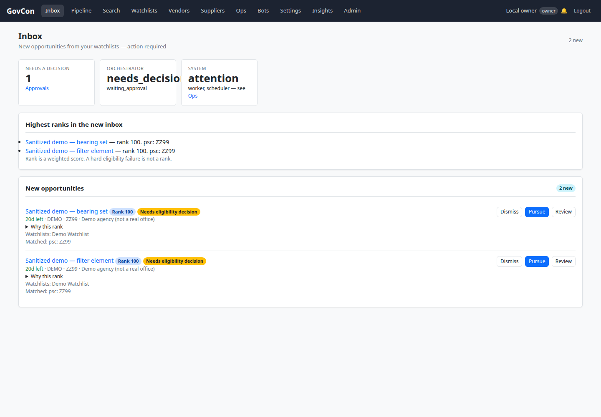
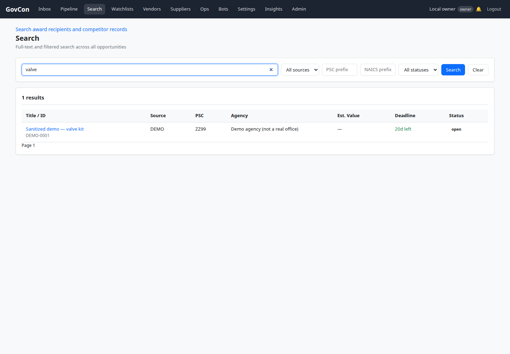
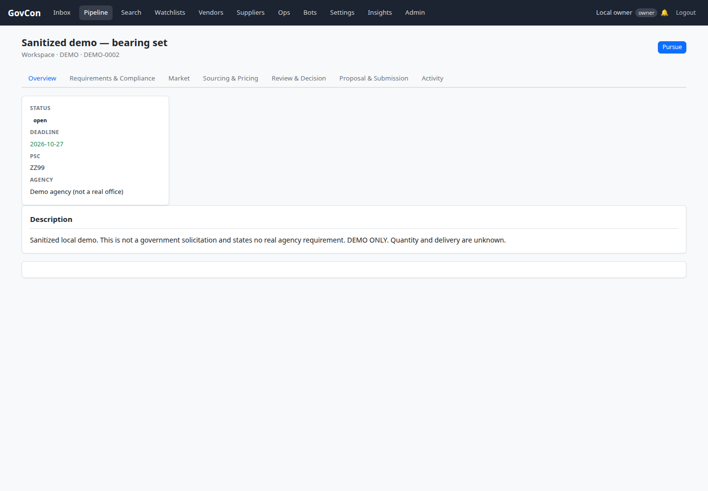
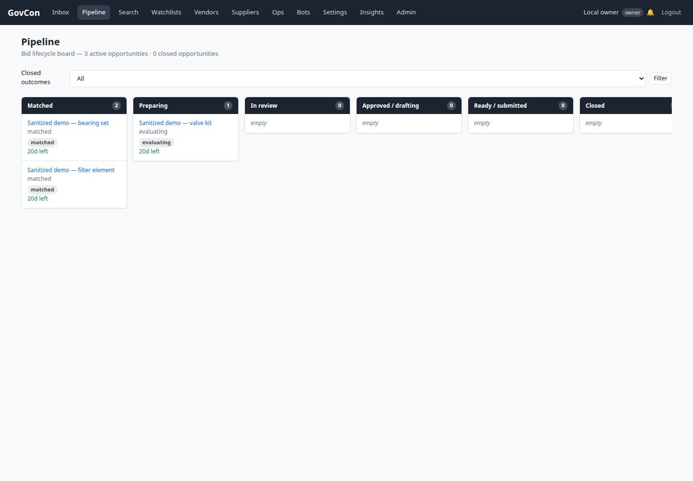
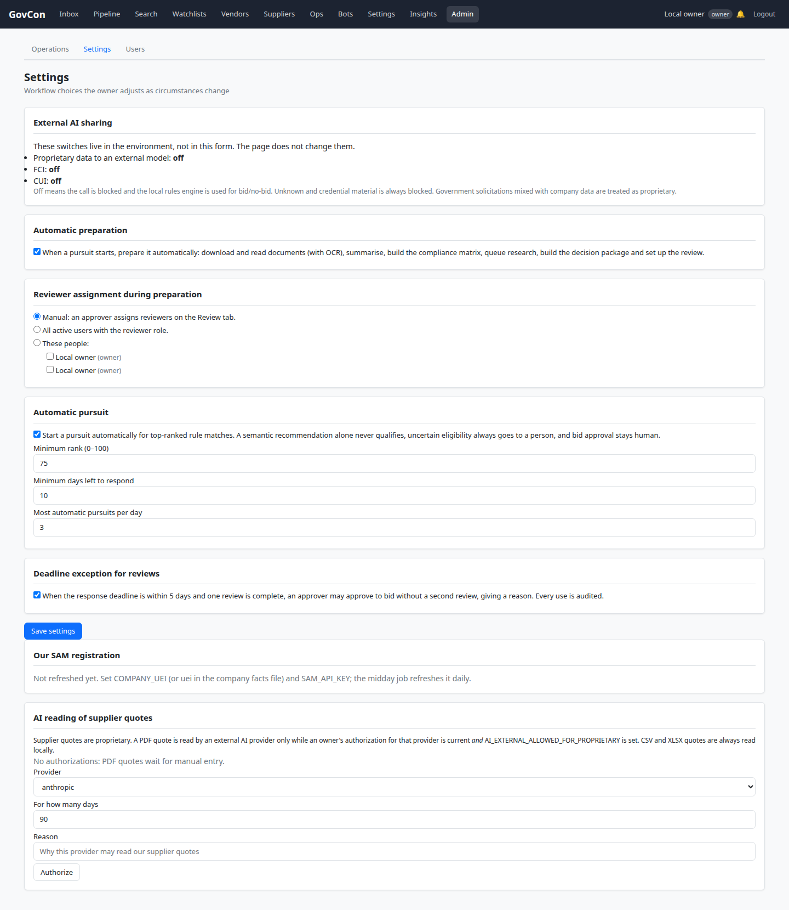
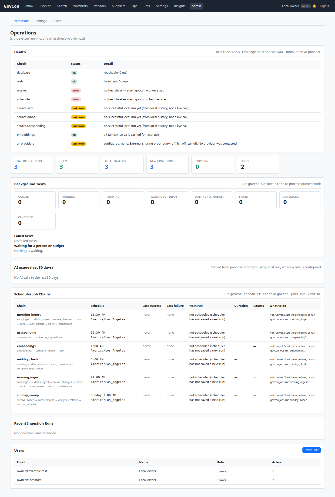
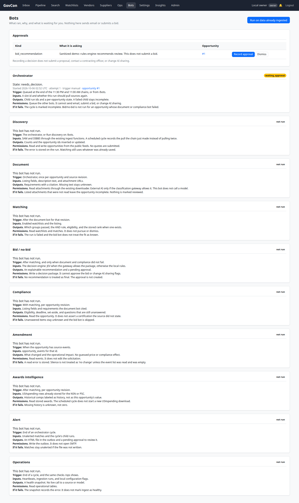

# UI walkthrough — 2026-10-06

Shots are from this branch after the merge of `fix/audit-and-workflow-2026-10-05` (`118a94a`) and `audit10032026` / PR 26. The web process was `govcon web serve --host 127.0.0.1 --port 8001` against a local Postgres database that had been migrated to Alembic head `d6e7f8a9b0c1`. Demo rows came from `govcon db seed-demo-opportunities` (source `demo`, PSC `ZZ99`, titles say they are not real solicitations). No page load called SAM, DIBBS, USAspending, or a model provider. The worker and the scheduler were not running, so `/` and `/ops` mark those heartbeats down.

The workflow line before this branch had the same inbox, search, pipeline, and settings shell. It did not have a Bots nav item, the inbox approvals and health cards, the External AI sharing card, Pacific clock text on `/ops`, or a stage subtitle on pipeline cards. Those are the surfaces below.

## Inbox

`/` shows the two demo matches that are not already in a pursuit, the pending bid recommendation, the orchestrator state `needs_decision`, and the missing worker and scheduler heartbeats.

## Search

`/search?q=valve` returns the sanitized valve-kit notice. One row, source `demo`, with the existing recipient-search link left in place. Pages are 50 rows; this query has a single row so no next page is offered.

## Opportunity

`/opp/2` is the workspace for `DEMO-0002`. The title says it is a sanitized demo.

## Pipeline

`/pipeline` keeps the workflow columns: matched, preparing, in review, drafting, ready, closed. `DEMO-0001` is in preparing with the stage subtitle `evaluating`. The other two demo notices sit in matched.

## Settings

`/settings` shows the external AI sharing flags read from the environment. On this process they are off. The form does not change them.

## Ops

`/ops` lists component checks and the six chains. Next-run text uses `America/Los_Angeles`. Source rows are local history (no ingest has run here, so they are stale). The worker and scheduler rows say to start those processes.

## Bots

`/bots` lists the ten bots, the last orchestrator run (`waiting_approval` / `needs_decision`), and the pending bid recommendation. The run button was not used. Recording an approval was not clicked; that action only stores the human decision.

